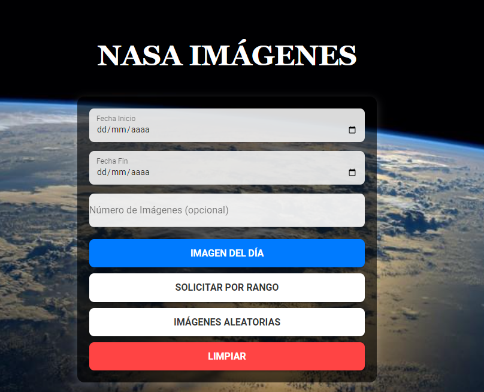

# Imágenes Random de la NASA

Este proyecto muestra imágenes aleatorias de la NASA utilizando la API Astronomy Picture of the Day (APOD).

## Tecnologías Utilizadas

- Vue.js
- API de la NASA (APOD)
- CSS con efectos de Glassmorphism

## Instalación y Uso

1. Clona este repositorio:
   ```sh
   git clone https://github.com/tu_usuario/nasa-images.git
   ```
2. Navega al directorio del proyecto:
   ```sh
   cd nasa-images
   ```
3. Instala las dependencias:
   ```sh
   npm install
   ```
4. Ejecuta el proyecto:
   ```sh
   npm run serve
   ```

## Características

- Muestra imágenes que la Nasa hace disponible: Imágenes por día, Imágenes por fechas e Imágenes random.
- Estructura: Cartas con imágenes, fecha, descripción y autor.
- Diseño moderno con Glassmorphism.
- Efectos interactivos al pasar el mouse sobre las tarjetas.

## Captura de Pantalla



## API Key de la NASA

Para obtener imágenes, necesitas una API Key de la NASA. Puedes obtener una en:
[NASA API](https://api.nasa.gov/)

## Autor

**Nombre** - [GitHub](https://github.com/AcuLuis)

## Licencia

Este proyecto está bajo la Licencia MIT.
